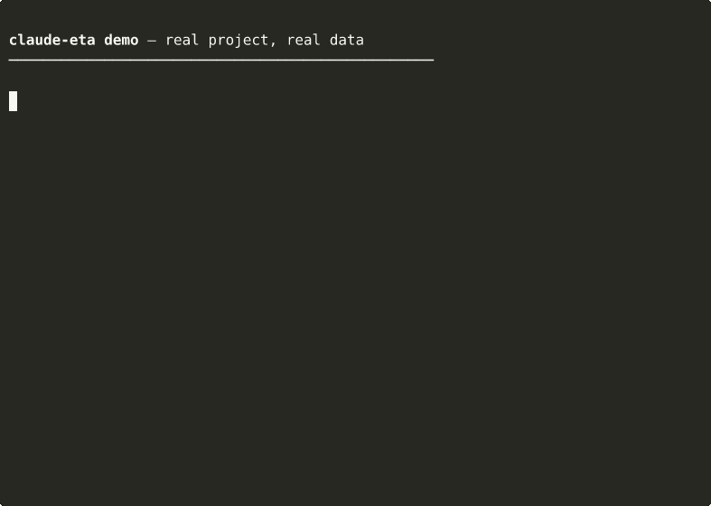

# claude-eta

<p align="center">
  <a href="https://github.com/mmmprod/claude-eta/blob/main/LICENSE"></a>
  <a href="https://nodejs.org">= 18" /></a>
  <a href="https://claude.com"></a>
  
  <a href="https://github.com/mmmprod/claude-eta/stargazers"></a>
</p>

## Claude has no concept of time. claude-eta gives it one.

Claude says "this should take about 2 days." You finish in 12 minutes.

LLMs have zero feedback between what they promise and what actually happens.
claude-eta creates that loop: it times every task, learns your velocity,
and feeds real data back into Claude before it responds.

After 10 tasks of the same type, ETAs appear automatically — calibrated on YOUR project.

<p align="center">
  
</p>

### How it works

1. You type a prompt
2. claude-eta classifies it, starts a timer, injects your velocity stats
3. Claude works. Tool calls, file ops, errors counted silently.
4. Task completes. Real duration recorded. Next estimate improves.
5. After 10 tasks of the same type, ETAs appear automatically at the start of Claude's responses.

## Eval results

Walk-forward replay over real, single-developer task history.

- **p80 coverage at prompt** typically lands in the **75–80% target range** (target: ~80%, since p80 is by definition the value the real duration should fall at or below 80% of the time).
- **MdAPE** (median absolute % error) sits in the **70–95% range** depending on the evaluator stage (`prompt` / `first edit` / `first bash`) — expected for a single-user dataset and tightens as task volume grows.

The exact numbers, the per-stage breakdown, and the version they were captured at live in [docs/eval-snapshot.md](docs/eval-snapshot.md), refreshed at each release. Run `/eta eval` to compute the same report on your own local task history.

### Also catches repair loops

<p align="center">
  
</p>

When Claude hits the same error 3+ times, claude-eta detects the pattern and intervenes:

- At 3x: warning injected at the next prompt
- At 5x: blocks and forces a strategy change

The key: it fingerprints error CONTENT, not just count. TDD (different errors each time) won't trigger it.

### Also catches hallucinated estimates

When Claude says "2 days" for a 10-minute task, the bullshit detector corrects inline
using your measured project data.

## Requirements

- Node.js >= 18
- Claude Code CLI (latest recommended)
- macOS, Linux, Windows (WSL)

## Install

Tested with the current Claude Code CLI. The working install flow is:

```bash
claude plugin marketplace add mmmprod/claude-eta
claude plugin install claude-eta
```

In any already-open Claude Code session, run `/reload-plugins` before trying `/eta`.

Fallback from a local checkout:

```bash
git clone https://github.com/mmmprod/claude-eta.git
cd claude-eta
claude plugin marketplace add ./
claude plugin install claude-eta --scope local
```

Current Claude Code uses `claude plugin install`, not `claude plugin add`.

### Update

```bash
claude plugin marketplace update claude-eta && claude plugin update claude-eta@claude-eta
```

Then restart Claude Code or run `/reload-plugins`.

### Uninstall

```bash
claude plugin uninstall claude-eta
```

Local data stays under `${CLAUDE_PLUGIN_DATA}` (typically `~/.claude/plugins/data/claude-eta-*/`) until you delete it manually.

## Commands

| Command | What it does |
|---------|-------------|
| `/eta` | Current session: active task, completed count, durations, tool calls |
| `/eta history` | Last 20 completed tasks with real durations and classifications |
| `/eta stats` | Averages by task type: median duration, tool calls, files touched |
| `/eta insights` | 9 deep analyses: timing patterns, model trends, error overhead, fatigue |
| `/eta eval` | Offline walk-forward accuracy report on your own data |
| `/eta inspect` | Raw view of stored data: project fingerprint, turn count, latest entry |
| `/eta auto` | Auto-ETA status and per-type accuracy |
| `/eta auto on/off` | Toggle automatic ETA injection at the start of Claude's responses |
| `/eta compare` | Read-only comparison against community baselines |
| `/eta contribute` | Preview anonymized data (dry run, requires `/eta community on` first) |
| `/eta contribute --confirm` | Upload anonymized data |
| `/eta community on/off` | Enable or disable community sharing consent |
| `/eta export` | Save anonymized data locally as JSON |
| `/eta recap` | Today's daily journal summary |
| `/eta help` | Full command list |

## Why not just `--max-turns`?

| | `--max-turns` | claude-eta |
|---|---|---|
| Detection | Counts turns blindly | Fingerprints error content |
| Trigger | After N turns (any turns) | After 3x same error |
| Response | Kills the session | Injects correction context |
| False positives | Cuts long legitimate sessions | Only fires on repeated identical errors |
| Learning | None | Learns your project's patterns over time |

`--max-turns 20` stops Claude after 20 turns whether it's stuck or productive.

claude-eta only intervenes when the same error repeats, and instead of killing
the session, it tells Claude what's going wrong and asks it to change strategy.

They're complementary: use `--max-turns` as a hard ceiling, use claude-eta
for intelligent early intervention.

## Privacy

Everything is local by default. No cloud. No telemetry. No upload unless you explicitly opt in.

`/eta inspect` shows the current stored view.

`/eta contribute` is manual and opt-in only. It previews exactly what would be sent before upload.

See [SECURITY.md](SECURITY.md) for the full storage and community-data details.

## Performance

claude-eta hooks run on every Claude Code lifecycle event.
Typical overhead is 30–50ms per hook on modern hardware (dominated by Node.js cold start).

Run `./scripts/bench-hooks.sh` to measure on your machine.

PostToolUse is the hot path. It reads and writes a single small JSON file (~1KB).
No historical data is loaded. No stats are computed.

## Advanced

<details>
<summary>How the loop detector works</summary>

```text
TDD (normal):     edit -> test fail A -> fix -> test fail B -> fix -> pass

Repair loop:      edit -> test fail A -> edit -> test fail A -> edit -> test fail A
                                        ^^^^^^^^^^^^^^^^^^^^^^^^^^^^^^^^^^^^^^^^^^^
                                        claude-eta detects this pattern
```

The key difference: in a loop, the same error keeps returning. claude-eta fingerprints
error content, normalizing away paths, numbers, and quoted values so structurally identical
failures match.

</details>

<details>
<summary>Auto-ETA (opt-in estimated duration at response start)</summary>

`/eta auto on` enables automatic ETA injection when claude-eta has enough local calibration for the task type.

`/eta auto` shows whether the feature is active and how accurate its recent p80 upper-bound coverage has been.

</details>

<details>
<summary>Community baselines</summary>

`/eta compare` is read-only and fetches aggregate community baselines.

`/eta contribute` stays blocked until you explicitly run `/eta community on`.

Only anonymized per-task aggregates are sent. Prompts, code, file paths, event logs, and project names are not uploaded.

</details>

<details>
<summary>Self-hosting community baselines</summary>

To point `/eta compare` and `/eta contribute` at your own Supabase project, set:

- `CLAUDE_ETA_SUPABASE_URL`
- `CLAUDE_ETA_SUPABASE_KEY`

The shipped anon key is intentionally public and restricted to `INSERT velocity_records`
and `SELECT baselines_cache`.

</details>

<details>
<summary>Insights (9 analyses)</summary>

`/eta insights` surfaces deeper patterns once enough task history exists:

- task type breakdowns
- tool and file-operation correlations
- timing patterns
- model and workflow trends

</details>

## License

MIT
